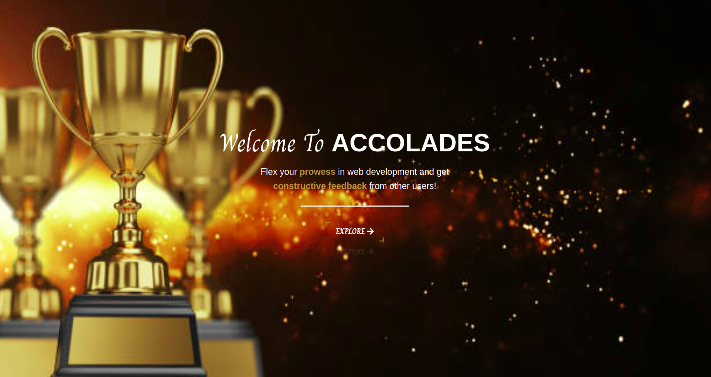

# Accolades

## Project Description
This project is a clone of the [awwwards](https://www.awwwards.com/) website, which showcases the best web design trends along with their ratings based on their design, usability, creativity and content. The project mimics the behaviour of this website by enabling users to upload their projects, view other users' projects and vote on them, search for various projects as well as updating their profile details among other functionalities. The application also implements a solid authentication system whereby users should be authorized before using the application.

## Author
- [Shalyne Waweru](https://github.com/Shalyne-Waweru)
- Email: shalynewaweru@gmail.com

## Figma Design Link
- [Get a sneak peak](https://www.figma.com/file/UgfCch0GTsveFJfQxMEMNr/Accolades?node-id=0%3A1)

## Website Live Link
- [Check it out here](https://project-accolades.herokuapp.com/)

## User Stories
A user will be able to:

- Sign in to the application to start using.
- Upload his/her projects to the application.
- See his/her profile with all the posted projects.
- View other users' projects in their respective profiles.
- Rate/ review other users' projects
- Search for projects based on their titles

## Technologies Used
- HTML
- CSS
- Bootstrap
- Javascript
- jQuery
- Python (Flask)
- PostgreSQL

## Project Setup Instructions

To start using this project use the following commands:

- git clone `https://github.com/Shalyne-Waweru/Accolades.git`
- `cd Accolades`
- run `python3.8 manage.py runserver` to serve the application

## License info
MIT License

Copyright (c) 2022 Shalyne Waweru

Permission is hereby granted, free of charge, to any person obtaining a copy
of this software and associated documentation files (the "Software"), to deal
in the Software without restriction, including without limitation the rights
to use, copy, modify, merge, publish, distribute, sublicense, and/or sell
copies of the Software, and to permit persons to whom the Software is
furnished to do so, subject to the following conditions:

The above copyright notice and this permission notice shall be included in all
copies or substantial portions of the Software.

THE SOFTWARE IS PROVIDED "AS IS", WITHOUT WARRANTY OF ANY KIND, EXPRESS OR
IMPLIED, INCLUDING BUT NOT LIMITED TO THE WARRANTIES OF MERCHANTABILITY,
FITNESS FOR A PARTICULAR PURPOSE AND NONINFRINGEMENT. IN NO EVENT SHALL THE
AUTHORS OR COPYRIGHT HOLDERS BE LIABLE FOR ANY CLAIM, DAMAGES OR OTHER
LIABILITY, WHETHER IN AN ACTION OF CONTRACT, TORT OR OTHERWISE, ARISING FROM,
OUT OF OR IN CONNECTION WITH THE SOFTWARE OR THE USE OR OTHER DEALINGS IN THE
SOFTWARE.
